# PLAN.md — Sistem Manajemen Perpustakaan (PBO)

## 1. Overview

| Item             | Detail                                     |
| ---------------- | ------------------------------------------ |
| **Nama Project** | `perpustakaan-pbo`                         |
| **Bahasa**       | Java 17+                                   |
| **Paradigma**    | Object-Oriented Programming (OOP)          |
| **Persistence**  | JSON (menggunakan Gson library)            |
| **Interface**    | CLI (Command Line Interface)               |
| **Target**       | Tugas Besar Pemrograman Berorientasi Objek |
| **Platform**     | Fedora Linux                               |
| **Author**       | (@kemal)                                   |

### Fitur Utama (MVP)

1. Login sebagai Admin atau Anggota
2. CRUD Buku (Admin)
3. CRUD Anggota (Admin)
4. Peminjaman & Pengembalian Buku
5. Hitung Denda Keterlambatan Otomatis
6. Pencarian Buku
7. Riwayat Peminjaman per Anggota
8. Data tersimpan ke JSON (persistent)

---

## 2. Struktur Folder Project

```
perpustakaan-pbo/
├── src/
│   ├── Main.java                          # Entry point program
│   ├── model/
│   │   ├── abstracts/
│   │   │   └── ItemPerpustakaan.java      # Abstract class untuk semua item
│   │   ├── BukuFisik.java
│   │   ├── BukuDigital.java
│   │   ├── Jurnal.java
│   │   ├── Anggota.java
│   │   ├── Admin.java
│   │   └── Peminjaman.java
│   ├── interfaces/
│   │   ├── IBorrowable.java
│   │   └── ISearchable.java
│   ├── collection/
│   │   └── Repository.java                # Generic class untuk CRUD & JSON
│   ├── exception/
│   │   ├── BukuTidakTersediaException.java
│   │   ├── AnggotaTidakValidException.java
│   │   ├── PeminjamanMelebihiBatasException.java
│   │   └── BukuTidakDitemukanException.java
│   ├── service/
│   │   ├── PerpustakaanService.java       # Business logic utama
│   │   └── AuthService.java               # Autentikasi
│   └── ui/
│       ├── MenuManager.java               # Base menu handler
│       ├── MenuAdmin.java
│       └── MenuAnggota.java
├── data/
│   ├── buku.json
│   ├── anggota.json
│   └── peminjaman.json
├── lib/
│   └── gson-2.10.1.jar                    # Library Gson (manual include)
└── README.md
```

---

## 3. Daftar Class Detail

### 3.1 Abstract Class

#### `ItemPerpustakaan` (abstract)

**Atribut:**

- `id: String`
- `judul: String`
- `tahunTerbit: int`
- `kategori: String`
- `tersedia: boolean`
- `penerbit: String`

**Method:**

- `ItemPerpustakaan()` (default constructor)
- `ItemPerpustakaan(String id, String judul, int tahunTerbit, String kategori, String penerbit)` (overloaded constructor)
- Getter/setter (enkapsulasi)
- `abstract double hitungDenda(int hariTerlambat)`
- `abstract String getTipe()`
- `String toString()`

### 3.2 Concrete Classes (Inheritance)

#### `BukuFisik extends ItemPerpustakaan`

- `jumlahHalaman: int`
- `lokasiRak: String`
- `double hitungDenda(int hari)` (override)
- `String getTipe()` (override)
- Constructor memanggil `super()`

#### `BukuDigital extends ItemPerpustakaan`

- `ukuranFile: double` (MB)
- `format: String` (PDF, EPUB, dll)
- `double hitungDenda(int hari)` (override — mungkin denda 0 atau lebih kecil)
- `String getTipe()` (override)

#### `Jurnal extends ItemPerpustakaan`

- `volume: int`
- `nomor: int`
- `bidang: String`
- `double hitungDenda(int hari)` (override)
- `String getTipe()` (override)

### 3.3 Interfaces

#### `IBorrowable`

- `void pinjam()`
- `void kembalikan()`
- `void perpanjang()`

#### `ISearchable`

- `boolean cocok(String keyword)` — search by keyword

### 3.4 Domain Lainnya

#### `Anggota`

- `id: String`
- `nama: String`
- `email: String`
- `telepon: String`
- `static final int MAX_PINJAM = 3`
- `pinjamanAktif: int`
- Getter/setter, `tambahPinjaman()`, `kurangiPinjaman()`, `bisaPinjam(): boolean`

#### `Admin`

- `username: String`
- `password: String`
- `boolean validatePassword(String password)`

#### `Peminjaman` — Composition dengan `ItemPerpustakaan`

- `idPeminjaman: String`
- `idAnggota: String` (relasi ke Anggota)
- `idItem: String` (relasi ke ItemPerpustakaan)
- `tanggalPinjam: LocalDate`
- `tanggalKembali: LocalDate`
- `tanggalDikembalikan: LocalDate`
- `status: StatusPeminjaman` (enum)
- `denda: double`
- `double hitungDenda()`
- `void perpanjang()`
- `void kembalikan()`

#### `StatusPeminjaman` (Enum)

- `DIPINJAM`, `DIKEMBALIKAN`, `TERLAMBAT`

### 3.5 Generic Class

#### `Repository<T>`

```
- items: ArrayList<T>
- filePath: String
- typeToken: Type
---
+ Repository(String filePath, Type typeToken)
+ add(T item): void
+ findById(String id): T
+ find(Predicate<T> predicate): List<T>
+ delete(String id): boolean
+ update(T updatedItem): boolean
+ getAll(): List<T>
+ saveToJson(): void
+ loadFromJson(): void
+ generateId(): String
```

Repository adalah **bounded generic**: `Repository<T extends ItemPerpustakaan>` untuk repository buku.

### 3.6 Service Layer

#### `PerpustakaanService` (Singleton Pattern)

- `- static instance: PerpustakaanService`
- `- repositoryBuku: Repository<ItemPerpustakaan>`
- `- repositoryAnggota: Repository<Anggota>`
- `- repositoryPeminjaman: Repository<Peminjaman>`
- `- currentUser: Object`
- `+ static getInstance(): PerpustakaanService`
- `+ login(String id, String password): boolean`
- `+ tambahBuku(ItemPerpustakaan buku): void`
- `+ hapusBuku(String id): void`
- `+ cariBuku(String keyword): List<ItemPerpustakaan>`
- `+ pinjamBuku(String idBuku, String idAnggota): void`
- `+ kembalikanBuku(String idPeminjaman): void`
- `+ perpanjangPeminjaman(String idPeminjaman): void`
- `+ getRiwayatPeminjaman(String idAnggota): List<Peminjaman>`

### 3.7 Exception Custom

| Exception                          | Trigger                           |
| ---------------------------------- | --------------------------------- |
| `BukuTidakTersediaException`       | Buku sedang dipinjam              |
| `AnggotaTidakValidException`       | ID anggota tidak ditemukan        |
| `PeminjamanMelebihiBatasException` | Anggota sudah mencapai max pinjam |
| `BukuTidakDitemukanException`      | ID buku tidak ditemukan           |

### 3.8 UI / Menu

**`MenuManager`** (abstract base):

- `void tampilkanHeader()`
- `int tampilkanMenu(String[] opsi)`
- `String bacaInput()`
- `void tungguEnter()`

**`MenuAdmin`** extends `MenuManager`:

1. Tambah Buku
2. Edit Buku
3. Hapus Buku
4. Lihat Semua Buku
5. Cari Buku
6. Tambah Anggota
7. Lihat Semua Anggota
8. Laporan Peminjaman
9. Logout

**`MenuAnggota`** extends `MenuManager`:

1. Cari Buku
2. Pinjam Buku
3. Kembalikan Buku
4. Riwayat Peminjaman
5. Perpanjang Peminjaman
6. Logout

---

## 4. UML Class Diagram (Mermaid)

```mermaid
classDiagram
    direction TB

    %% ── ENUM ──
    class StatusPeminjaman {
        <<enumeration>>
        DIPINJAM
        DIKEMBALIKAN
        TERLAMBAT
    }

    %% ── INTERFACES ──
    class IBorrowable {
        <<interface>>
        + pinjam() void
        + kembalikan() void
        + perpanjang() void
    }
    class ISearchable {
        <<interface>>
        + cocok(String keyword) boolean
    }

    %% ── ABSTRACT CLASS ──
    class ItemPerpustakaan {
        <<abstract>>
        - String id
        - String judul
        - int tahunTerbit
        - String kategori
        - boolean tersedia
        - String penerbit
        + hitungDenda(int)* double
        + getTipe()* String
    }

    %% ── CONCRETE CLASSES ──
    class BukuFisik {
        - int jumlahHalaman
        - String lokasiRak
        + hitungDenda(int) double
        + getTipe() String
    }
    class BukuDigital {
        - double ukuranFile
        - String format
        + hitungDenda(int) double
        + getTipe() String
    }
    class Jurnal {
        - int volume
        - int nomor
        - String bidang
        + hitungDenda(int) double
        + getTipe() String
    }

    class Anggota {
        - String id
        - String nama
        - String email
        - String telepon
        - int pinjamanAktif
        + bisaPinjam() boolean
        + tambahPinjaman() void
        + kurangiPinjaman() void
    }
    class Admin {
        - String username
        - String password
        + validatePassword(String) boolean
    }
    class Peminjaman {
        - String idPeminjaman
        - String idAnggota
        - String idItem
        - LocalDate tanggalPinjam
        - LocalDate tanggalKembali
        - LocalDate tanggalDikembalikan
        - StatusPeminjaman status
        - double denda
        + hitungDenda() double
        + perpanjang() void
        + kembalikan() void
    }

    class Repository~T~ {
        - ArrayList~T~ items
        - String filePath
        + add(T) void
        + findById(String) T
        + find(Predicate) List~T~
        + delete(String) boolean
        + update(T) boolean
        + getAll() List~T~
        + saveToJson() void
        + loadFromJson() void
        + generateId() String
    }

    class PerpustakaanService {
        - Repository bukuRepo
        - Repository anggotaRepo
        - Repository peminjamanRepo
        - Object currentUser
        + getInstance()$ PerpustakaanService
        + login(String,String) boolean
        + tambahBuku(ItemPerpustakaan) void
        + cariBuku(String) List
        + pinjamBuku(String,String) void
        + kembalikanBuku(String) void
        + getRiwayat(String) List
    }

    class MenuManager {
        <<abstract>>
        + tampilkanHeader() void
        + tampilkanMenu(String[]) int
        + bacaInput() String
        + tungguEnter() void
    }
    class MenuAdmin
    class MenuAnggota

    %% ── EXCEPTIONS ──
    class BukuTidakTersediaException
    class AnggotaTidakValidException
    class PeminjamanMelebihiBatasException
    class BukuTidakDitemukanException

    %% ── RELATIONSHIPS ──
    ItemPerpustakaan <|-- BukuFisik
    ItemPerpustakaan <|-- BukuDigital
    ItemPerpustakaan <|-- Jurnal
    ItemPerpustakaan ..|> IBorrowable
    ItemPerpustakaan ..|> ISearchable

    Peminjaman --> Anggota : idAnggota
    Peminjaman --> ItemPerpustakaan : idItem
    Peminjaman --> StatusPeminjaman

    PerpustakaanService --> Repository : mengelola

    MenuAdmin --|> MenuManager
    MenuAnggota --|> MenuManager

    BukuTidakTersediaException --|> Exception
    AnggotaTidakValidException --|> Exception
    PeminjamanMelebihiBatasException --|> Exception
    BukuTidakDitemukanException --|> Exception
```



---

## 5. Alur Program (Flow)

```
[Start]
    │
    ▼
[Load Data dari JSON] → Load buku.json, anggota.json, peminjaman.json
    │
    ▼
[Tampil Menu Login] → 1. Admin  2. Anggota  0. Keluar
    │
    ├──► [Admin Login] → Menu Admin
    │                      ├ 1. Tambah Buku
    │                      ├ 2. Edit Buku
    │                      ├ 3. Hapus Buku
    │                      ├ 4. Lihat Semua Buku
    │                      ├ 5. Cari Buku
    │                      ├ 6. Tambah Anggota
    │                      ├ 7. Lihat Semua Anggota
    │                      ├ 8. Laporan Peminjaman
    │                      └ 0. Logout
    │
    ├──► [Anggota Login] → Menu Anggota
    │                      ├ 1. Cari Buku
    │                      ├ 2. Pinjam Buku
    │                      ├ 3. Kembalikan Buku
    │                      ├ 4. Riwayat Peminjaman
    │                      ├ 5. Perpanjang Peminjaman
    │                      └ 0. Logout
    │
    └──► [Keluar] → Save Data ke JSON → [End]
```

---

## 6. Implementasi Persistence (JSON + Gson)

### Strategi

1. **Gson** digunakan untuk serialize/deserialize objek ke JSON
2. **Repository<T>** class generik bertanggung jawab atas I/O file
3. **TypeToken** diperlukan karena Java generics type erasure
4. Data disimpan per entity di folder `data/`
5. **RuntimeTypeAdapterFactory** Gson diperlukan untuk polymorphic deserialization ItemPerpustakaan

### Contoh Struktur JSON

**buku.json**

```json
[
	{
		"type": "BukuFisik",
		"id": "B001",
		"judul": "Pemrograman Berorientasi Objek",
		"tahunTerbit": 2024,
		"kategori": "Teknologi",
		"penerbit": "Informatika",
		"tersedia": true,
		"jumlahHalaman": 350,
		"lokasiRak": "A1-01"
	}
]
```

**anggota.json**

```json
[
	{
		"id": "A001",
		"nama": "Budi Santoso",
		"email": "budi@email.com",
		"telepon": "08123456789",
		"pinjamanAktif": 0
	}
]
```

**peminjaman.json**

```json
[
	{
		"idPeminjaman": "P001",
		"idAnggota": "A001",
		"idItem": "B001",
		"tanggalPinjam": "2024-05-01",
		"tanggalKembali": "2024-05-08",
		"tanggalDikembalikan": null,
		"status": "DIPINJAM",
		"denda": 0.0
	}
]
```

---

## 7. Checklist Konsep OOP yang Tercakup

| #   | Konsep                                    | Implementasi                                           | Status |
| --- | ----------------------------------------- | ------------------------------------------------------ | ------ |
| 1   | **Class & Object**                        | Semua model class                                      | ☐      |
| 2   | **Constructor (default & parameterized)** | Semua model class                                      | ☐      |
| 3   | **Constructor Overloading**               | ItemPerpustakaan, Anggota                              | ☐      |
| 4   | **Enkapsulasi**                           | Private fields + public getter/setter                  | ☐      |
| 5   | **Inheritance (Single & Hierarchical)**   | BukuFisik, Digital, Jurnal ← ItemPerpustakaan          | ☐      |
| 6   | **Abstract Class**                        | ItemPerpustakaan                                       | ☐      |
| 7   | **Abstract Method**                       | hitungDenda(), getTipe()                               | ☐      |
| 8   | **Interface**                             | IBorrowable, ISearchable                                | ☐      |
| 9   | **Implements Multiple Interface**         | ItemPerpustakaan implements IBorrowable, ISearchable   | ☐      |
| 10  | **Method Overriding**                     | hitungDenda(), getTipe() di tiap subclass              | ☐      |
| 11  | **Method Overloading**                    | Constructor overload, overloaded method                | ☐      |
| 12  | **Polymorphism (Inclusion)**              | List<ItemPerpustakaan> menyimpan semua subclass        | ☐      |
| 13  | **Generic Class**                         | Repository<T>                                          | ☐      |
| 14  | **Bounded Generic**                       | Repository<T extends ItemPerpustakaan>                 | ☐      |
| 15  | **Generic Method**                        | find(Predicate<T>)                                     | ☐      |
| 16  | **Collection (ArrayList)**                | ArrayList<T> di Repository, List processing            | ☐      |
| 17  | **Exception Handling**                    | Try-catch di service, throws declaration               | ☐      |
| 18  | **Custom Exception**                      | 4 kelas exception khusus                               | ☐      |
| 19  | **Association**                           | Peminjangan → Anggota (via ID)                         | ☐      |
| 20  | **Composition**                           | Peminjaman berisi reference ke ItemPerpustakaan        | ☐      |
| 21  | **Aggregation**                           | PerpustakaanService mengelola Repository               | ☐      |
| 22  | **Dependency**                            | UI layer bergantung pada Service layer                 | ☐      |
| 23  | **super Keyword**                         | Constructor chaining di subclass                       | ☐      |
| 24  | **this Keyword**                          | Resolve shadowing, constructor chaining                | ☐      |
| 25  | **Final Variable**                        | MAX_PINJAM = 3                                         | ☐      |
| 26  | **Static Variable**                       | MAX_PINJAM, instance PerpustakaanService               | ☐      |
| 27  | **Static Method**                         | getInstance() singleton                                | ☐      |
| 28  | **Singleton Pattern**                     | PerpustakaanService                                    | ☐      |
| 29  | **Enum**                                  | StatusPeminjaman                                       | ☐      |
| 30  | **Persistent Object**                     | Save/load JSON via Gson                                | ☐      |
| 31  | **Instance vs Class Member**              | Instance: id, nama; Class: MAX_PINJAM                  | ☐      |
| 32  | **Message Passing**                       | Main → Service → Repository                            | ☐      |

**Total: 32 konsep OOP**

---

## 8. Timeline / Milestone

| Fase                              | Task                                                        | Target Selesai |
| --------------------------------- | ----------------------------------------------------------- | -------------- |
| **Fase 1: Setup & Model**         | Struktur folder, model classes, interfaces, enum, exception | Hari 1-2       |
| **Fase 2: Generic & Persistence** | Repository<T>, Gson setup, save/load JSON                   | Hari 3-4       |
| **Fase 3: Service & Logic**       | PerpustakaanService, AuthService, business logic            | Hari 5-6       |
| **Fase 4: UI**                    | MenuManager, MenuAdmin, MenuAnggota, Main                   | Hari 7-8       |
| **Fase 5: Finalisasi**            | Testing, UML Mermaid (README), GitHub push                  | Hari 9-10      |

---

## 9. Setup & Run

### Prerequisites

- Java JDK 17+
- Gson JAR 2.10.1 di `lib/`

### Compile & Run

```bash
# Compile
javac -cp "lib/*" -d out src/**/*.java

# Run
java -cp "out:lib/*" Main
```

### Via VS Code

1. Buka folder project
2. Add `lib/gson-2.10.1.jar` ke classpath (Referenced Libraries)
3. Run `Main.java`

---

## 10. GitHub Setup

```bash
git init
git add .
git commit -m "feat: initial project structure"
git remote add origin https://github.com/kemal/perpustakaan-pbo.git
git push -u origin main
```

### .gitignore

```
*.class
out/
.idea/
*.iml
.vscode/
```
