# Sistem Manajemen Perpustakaan

> **Tugas Besar Pemrograman Berorientasi Objek** — Universitas Diponegoro

Aplikasi CLI berbasis Java untuk manajemen perpustakaan: kelola buku, anggota, peminjaman, dan denda otomatis. Data tersimpan dalam format JSON.


## ✨ Fitur

| Fitur                              | Admin |   Anggota   |
| ---------------------------------- | :---: | :---------: |
| Login                              |  ✅   | ✅ (via ID) |
| Tambah Buku (Fisik/Digital/Jurnal) |  ✅   |
| Edit / Hapus Buku                  |  ✅   |
| Lihat Semua Buku                   |  ✅   |             |
| Cari Buku                          |  ✅   |     ✅      |
| Manajemen Anggota                  |  ✅   |             |
| Laporan Peminjaman + Denda         |  ✅   |             |
| Pinjam Buku                        |       |     ✅      |
| Kembalikan Buku (auto denda)       |       |     ✅      |
| Riwayat Peminjaman                 |       |     ✅      |
| Perpanjang Peminjaman              |       |     ✅      |
| Data Persistent (JSON)             |  ✅   |     ✅      |

## 📝 Format Input Data

### Buku Fisik

| Field          | Tipe                  | Wajib? | Contoh                           |
| -------------- | --------------------- | :----: | -------------------------------- |
| Judul          | String                |   ✅   | "Pemrograman Berorientasi Objek" |
| Tahun Terbit   | Angka positif         |   ✅   | 2024                             |
| Kategori       | Pilih dari menu (1-8) |   ✅   | Teknologi, Ilmiah, Fiksi, ...    |
| Penulis        | String                |   ✅   | "Rosa A.S."                      |
| Penerbit       | String                |        | "Informatika"                    |
| Jumlah Halaman | Angka positif         |   ✅   | 350                              |
| Lokasi Rak     | Format `[A]\d+-\d+`   |   ✅   | `A1-01`, `B2-15`                 |
| Jumlah Stok    | Angka positif         |   ✅   | 3                                |

### Buku Digital

| Field        | Tipe               | Wajib? | Contoh                      |
| ------------ | ------------------ | :----: | --------------------------- |
| Judul        | String             |   ✅   | "Belajar Java dalam Sehari" |
| Tahun Terbit | Angka positif      |   ✅   | 2024                        |
| Kategori     | Pilih dari menu    |   ✅   | Teknologi                   |
| Penulis      | String             |   ✅   | "Budi Raharjo"              |
| Penerbit     | String             |        | "E-Book Publisher"          |
| Ukuran File  | Angka desimal (MB) |   ✅   | 5.2                         |
| Format       | String             |   ✅   | PDF                         |

### Jurnal

| Field       | Tipe                                              | Wajib? | Contoh          |
| ----------- | ------------------------------------------------- | :----: | --------------- |
| ...         | (sama: judul, tahun, kategori, penulis, penerbit) |        |                 |
| Volume      | Angka positif                                     |   ✅   | 12              |
| Nomor       | Angka positif                                     |   ✅   | 1               |
| Bidang Ilmu | String                                            |        | "Ilmu Komputer" |
| Jumlah Stok | Angka positif                                     |   ✅   | 2               |

### Format Lokasi Rak

- **Pola:** `[Huruf Lantai][Nomor Rak]-[Slot]`
- Contoh valid: `A1-01`, `B2-15`, `C3-100`
- Contoh tidak valid: `a1` (huruf kecil), `A-1` (tanpa nomor rak), `deket pintu`


## 🧩 UML Class Diagram

```mermaid
classDiagram
    direction TB

    %% ── ENUM ──
    class StatusPeminjaman {
        <<enumeration>>
        DIPINJAM
        DIKEMBALIKAN
        TERLAMBAT
    }

    %% ── INTERFACES ──
    class Identifiable {
        <<interface>>
        + getId() String
    }
    class IBorrowable {
        <<interface>>
        + pinjam() void
        + kembalikan() void
        + perpanjang() void
    }
    class ISearchable {
        <<interface>>
        + cocok(String keyword) boolean
    }

    %% ── ABSTRACT CLASS ──
    class ItemPerpustakaan {
        <<abstract>>
        - String id
        - String judul
        - int tahunTerbit
        - Kategori kategori
        - String penerbit
        - String penulis
        - int stok
        - int dipinjam
        + hitungDenda(int)* double
        + getTipe()* String
    }

    %% ── CONCRETE CLASSES ──
    class BukuFisik {
        - int jumlahHalaman
        - String lokasiRak
        + hitungDenda(int) double
        + getTipe() String
    }
    class BukuDigital {
        - double ukuranFile
        - String format
        + hitungDenda(int) double
        + getTipe() String
    }
    class Jurnal {
        - int volume
        - int nomor
        - String bidang
        + hitungDenda(int) double
        + getTipe() String
    }

    class Anggota {
        - String id
        - String nama
        - int pinjamanAktif
        + bisaPinjam() boolean
        + tambahPinjaman() void
        + kurangiPinjaman() void
    }
    class Admin {
        - String username
        - String password
        + validatePassword(String) boolean
    }
    class Peminjaman {
        - String idPeminjaman
        - String idAnggota
        - String idItem
        - LocalDate tanggalPinjam
        - LocalDate tanggalKembali
        - LocalDate tanggalDikembalikan
        - StatusPeminjaman status
        - double denda
        + hitungDenda() double
        + perpanjang() void
        + kembalikan() int
    }

    class Repository~T~ {
        - ArrayList~T~ items
        - String filePath
        + add(T) void
        + findById(String) T
        + find(Predicate) List~T~
        + delete(String) boolean
        + update(T) boolean
        + getAll() List~T~
        + saveToJson() boolean
        + loadFromJson() void
        + generateId() String
    }

    class PerpustakaanService {
        - Repository bukuRepo
        - Repository anggotaRepo
        - Repository peminjamanRepo
        - Object currentUser
        + getInstance()$ PerpustakaanService
        + login(String,String) boolean
        + tambahBuku() void
        + cariBuku() List
        + pinjamBuku() void
        + kembalikanBuku() Peminjaman
        + getRiwayat() List
    }

    class MenuManager {
        + tampilkanHeader() void
        + tampilkanMenu(String[]) int
        + bacaInput() String
        + tungguEnter() void
    }
    class MenuAdmin
    class MenuAnggota
    class Config {
        + getInstance()$ Config
        + getAdminUsername() String
        + getAdminPassword() String
    }

    %% ── EXCEPTIONS ──
    class BukuTidakTersediaException
    class AnggotaTidakValidException
    class PeminjamanMelebihiBatasException
    class BukuTidakDitemukanException

    %% ── RELATIONSHIPS ──
    ItemPerpustakaan ..|> Identifiable
    ItemPerpustakaan ..|> IBorrowable
    ItemPerpustakaan ..|> ISearchable
    Anggota ..|> Identifiable
    Peminjaman ..|> Identifiable
    Admin ..|> Identifiable

    ItemPerpustakaan <|-- BukuFisik
    ItemPerpustakaan <|-- BukuDigital
    ItemPerpustakaan <|-- Jurnal

    Peminjaman --> Anggota : idAnggota
    Peminjaman --> ItemPerpustakaan : idItem
    Peminjaman --> StatusPeminjaman

    PerpustakaanService --> Repository : mengelola
    Config --> Admin : credential

    MenuAdmin --|> MenuManager
    MenuAnggota --|> MenuManager

    BukuTidakTersediaException --|> Exception
    AnggotaTidakValidException --|> Exception
    PeminjamanMelebihiBatasException --|> Exception
    BukuTidakDitemukanException --|> Exception

```


## 📁 Struktur Project


```
perpustakaan-pbo/
├── src/
│   ├── Main.java              — Entry point
│   ├── model/                 — Domain classes
│   │   ├── abstract/
│   │   │   └── ItemPerpustakaan.java
│   │   ├── BukuFisik.java
│   │   ├── BukuDigital.java
│   │   ├── Jurnal.java
│   │   ├── Anggota.java
│   │   ├── Admin.java
│   │   ├── Peminjaman.java
│   │   ├── AddResult.java          — Enum hasil tambah buku
│   │   └── StatusPeminjaman.java
│   ├── interfaces/
│   │   ├── Identifiable.java
│   │   ├── IBorrowable.java
│   │   ├── ISearchable.java
│   │   └── ILibraryService.java
│   ├── collection/
│   │   └── Repository.java
│   ├── exception/
│   │   ├── BukuTidakTersediaException.java
│   │   ├── AnggotaTidakValidException.java
│   │   ├── PeminjamanMelebihiBatasException.java
│   │   ├── BukuTidakDitemukanException.java
│   │   └── PeminjamanTidakDitemukanException.java
│   ├── service/
│   │   ├── PerpustakaanService.java — Facade utama
│   │   ├── BukuService.java        — CRUD buku & anggota
│   │   ├── PeminjamanService.java  — Pinjam/kembalikan/denda
│   │   └── AuthService.java        — Autentikasi
│   ├── ui/
│   │   ├── MenuManager.java
│   │   ├── MenuAdmin.java
│   │   └── MenuAnggota.java
│   └── util/
│       └── Config.java
│
├── scripts/
│   ├── build.bat / build.sh     — Compile
│   ├── test.bat / test.sh       — Test
│   └── test-download.sh         — Download JUnit
│
├── test/
│   └── unit/
│       ├── model/               — 7 test classes
│       ├── collection/          — RepositoryTest
│       └── service/             — AuthServiceTest, PerpustakaanServiceTest
│
├── data/
│   ├── buku.json
│   ├── anggota.json
│   └── peminjaman.json
├── lib/
│   ├── gson-2.10.1.jar
│   └── gson-extras-2.13.2-rc1.jar
├── config.properties / config.properties.example
├── .gitignore
├── AGENTS.md
├── PLAN.md
└── README.md
```


## 🚀 Cara Menjalankan

### Prerequisites
- Java JDK 17+
- Tidak perlu IDE — cukup terminal

### Compile (Linux/macOS)
```bash
javac -cp "lib/*" -d out -sourcepath src src/Main.java
```

### Compile (Windows CMD)
```batch
javac -cp "lib/*" -d out -sourcepath src src\Main.java
```

### Run (Linux/macOS)
```bash
java -cp "out:lib/*" Main
```

### Run (Windows CMD)
```batch
java -cp "out;lib/*" Main
```

### Build Scripts (Alternatif)

Linux/macOS:
```bash
chmod +x scripts/build.sh && ./scripts/build.sh
# Run
java -cp "out:lib/*" Main
```

Windows:
```batch
scripts\build.bat
REM Run
java -cp "out;lib/*" Main
```

### Compile Tests (Linux/macOS)
Requires JUnit standalone jar. Run `scripts/test-download.sh` first.
```bash
# Compile tests
javac -cp "lib/*:out" -d out -sourcepath src:test test/unit/service/*.java test/unit/collection/*.java test/unit/model/*.java

# Run tests
java -jar lib/junit-platform-console-standalone-1.10.1.jar --cp "out:lib/*" --scan-class-path
```

### Compile Tests (Windows CMD)
```batch
REM Download test deps first: scripts\test-download.bat
REM Compile tests
dir /s /B test\*.java > test_sources.txt
javac -cp "lib/*;out" -d out -sourcepath "src;test" @test_sources.txt
del test_sources.txt

REM Run tests
java -jar lib\junit-platform-console-standalone-1.10.1.jar --cp "out;lib/*" --scan-class-path
```

---
## 🔐 Login


### Admin

- **Username:** `admin`
- **Password:** lihat `config.properties` (copy dari `config.properties.example` jika belum ada)

### Anggota (Sample Data)

|  ID  | Nama         | Pinjaman |
| :--: | ------------ | :------: |
| A001 | Budi Santoso |   0/3    |
| A002 | Siti Rahayu  |   0/3    |
| A003 | Ahmad Fauzi  |   0/3    |

## 🧠 Konsep OOP yang Diterapkan

| # | Konsep | Status |
|---|--------|:-----:|
| 1 | Class & Object | ✅ |
| 2 | Constructor (default + overloading) | ✅ |
| 3 | Enkapsulasi (private + getter/setter) | ✅ |
| 4 | Inheritance (single + hierarchical) | ✅ |
| 5 | Abstract Class & Abstract Method | ✅ |
| 6 | Interface & Implements Multiple Interface | ✅ |
| 7 | Method Overriding & Overloading | ✅ |
| 8 | Polymorphism (Inclusion via List) | ✅ |
| 9 | Generic Class + Bounded Generic | ✅ |
| 10 | Collection (ArrayList, Stream API) | ✅ |
| 11 | Exception Handling & Custom Exception | ✅ |
| 12 | Association, Composition, Aggregation | ✅ |
| 13 | super, this, final, static | ✅ |
| 14 | Singleton Pattern, Enum | ✅ |
| 15 | Persistent Object (JSON + Gson) | ✅ |
| 16 | Message Passing (Main → Service → Repository) | ✅ |
| **Total** | **32 konsep** | **✅** |


## 📦 Dependencies

| Library | Versi | Penggunaan |
|---------|-------|------------|
| [Gson](https://github.com/google/gson) | 2.10.1 | Serialisasi/deserialisasi JSON |
| [Gson Extras](https://github.com/google/gson) | 2.13.2-rc1 | Polymorphic type adapter untuk inheritance |


## 📝 Author

- **Nama:** [@kemal](https://github.com/kemal-faza)
- **Mata Kuliah:** Pemrograman Berorientasi Objek
- **Institusi:** Universitas Diponegoro

*Project ini dibuat sebagai tugas besar mata kuliah Pemrograman Berorientasi Objek.*
