# Sistem Manajemen Perpustakaan

> **Tugas Besar Pemrograman Berorientasi Objek** — Universitas Diponegoro

Aplikasi CLI berbasis Java untuk manajemen perpustakaan: kelola buku, anggota, peminjaman, dan denda otomatis. Data tersimpan dalam format JSON.

---

## ✨ Fitur

| Fitur | Admin | Anggota |
|-------|:-----:|:-------:|
| Login | ✅ | ✅ (via ID) |
| Tambah Buku (Fisik/Digital/Jurnal) | ✅ | |
| Edit / Hapus Buku | ✅ | |
| Lihat Semua Buku | ✅ | |
| Cari Buku | ✅ | ✅ |
| Manajemen Anggota | ✅ | |
| Laporan Peminjaman + Denda | ✅ | |
| Pinjam Buku | | ✅ |
| Kembalikan Buku (auto denda) | | ✅ |
| Riwayat Peminjaman | | ✅ |
| Perpanjang Peminjaman | | ✅ |
| Data Persistent (JSON) | ✅ | ✅ |

---

## 🧩 UML Class Diagram

```mermaid
classDiagram
    direction TB

    %% ── ENUM ──
    class StatusPeminjaman {
        <<enumeration>>
        DIPINJAM
        DIKEMBALIKAN
        TERLAMBAT
    }

    %% ── INTERFACES ──
    class Identifiable {
        <<interface>>
        + getId() String
    }
    class IBorrowable {
        <<interface>>
        + pinjam() void
        + kembalikan() void
        + perpanjang() void
    }
    class ISearchable {
        <<interface>>
        + cocok(String keyword) boolean
    }

    %% ── ABSTRACT CLASS ──
    class ItemPerpustakaan {
        <<abstract>>
        - String id
        - String judul
        - int tahunTerbit
        - String kategori
        - boolean tersedia
        - String penerbit
        + hitungDenda(int)* double
        + getTipe()* String
    }

    %% ── CONCRETE CLASSES ──
    class BukuFisik {
        - int jumlahHalaman
        - String lokasiRak
        + hitungDenda(int) double
        + getTipe() String
    }
    class BukuDigital {
        - double ukuranFile
        - String format
        + hitungDenda(int) double
        + getTipe() String
    }
    class Jurnal {
        - int volume
        - int nomor
        - String bidang
        + hitungDenda(int) double
        + getTipe() String
    }

    class Anggota {
        - String id
        - String nama
        - String email
        - String telepon
        - int pinjamanAktif
        + bisaPinjam() boolean
        + tambahPinjaman() void
        + kurangiPinjaman() void
    }
    class Admin {
        - String username
        - String password
        + validatePassword(String) boolean
    }
    class Peminjaman {
        - String idPeminjaman
        - String idAnggota
        - String idItem
        - LocalDate tanggalPinjam
        - LocalDate tanggalKembali
        - LocalDate tanggalDikembalikan
        - StatusPeminjaman status
        - double denda
        + hitungDenda() double
        + perpanjang() void
        + kembalikan() int
    }

    class Repository~T~ {
        - ArrayList~T~ items
        - String filePath
        + add(T) void
        + findById(String) T
        + find(Predicate) List~T~
        + delete(String) boolean
        + update(T) boolean
        + getAll() List~T~
        + saveToJson() boolean
        + loadFromJson() void
        + generateId() String
    }

    class PerpustakaanService {
        - Repository bukuRepo
        - Repository anggotaRepo
        - Repository peminjamanRepo
        - Object currentUser
        + getInstance()$ PerpustakaanService
        + login(String,String) boolean
        + tambahBuku() void
        + cariBuku() List
        + pinjamBuku() void
        + kembalikanBuku() Peminjaman
        + getRiwayat() List
    }

    class MenuManager {
        + tampilkanHeader() void
        + tampilkanMenu(String[]) int
        + bacaInput() String
        + tungguEnter() void
    }
    class MenuAdmin
    class MenuAnggota
    class Config {
        + getInstance()$ Config
        + getAdminUsername() String
        + getAdminPassword() String
    }

    %% ── EXCEPTIONS ──
    class BukuTidakTersediaException
    class AnggotaTidakValidException
    class PeminjamanMelebihiBatasException
    class BukuTidakDitemukanException

    %% ── RELATIONSHIPS ──
    ItemPerpustakaan ..|> Identifiable
    ItemPerpustakaan ..|> IBorrowable
    ItemPerpustakaan ..|> ISearchable
    Anggota ..|> Identifiable
    Peminjaman ..|> Identifiable
    Admin ..|> Identifiable

    ItemPerpustakaan <|-- BukuFisik
    ItemPerpustakaan <|-- BukuDigital
    ItemPerpustakaan <|-- Jurnal

    Peminjaman --> Anggota : idAnggota
    Peminjaman --> ItemPerpustakaan : idItem
    Peminjaman --> StatusPeminjaman

    PerpustakaanService --> Repository : mengelola
    Config --> Admin : credential

    MenuAdmin --|> MenuManager
    MenuAnggota --|> MenuManager

    BukuTidakTersediaException --|> Exception
    AnggotaTidakValidException --|> Exception
    PeminjamanMelebihiBatasException --|> Exception
    BukuTidakDitemukanException --|> Exception
```



---

## 📁 Struktur Project

```
perpustakaan-pbo/
├── src/
│   ├── Main.java
│   ├── model/
│   │   ├── base/
│   │   │   └── ItemPerpustakaan.java
│   │   ├── BukuFisik.java
│   │   ├── BukuDigital.java
│   │   ├── Jurnal.java
│   │   ├── Anggota.java
│   │   ├── Admin.java
│   │   ├── Peminjaman.java
│   │   └── StatusPeminjaman.java
│   ├── interfaces/
│   │   ├── Identifiable.java
│   │   ├── IBorrowable.java
│   │   └── ISearchable.java
│   ├── collection/
│   │   └── Repository.java
│   ├── exception/
│   │   ├── BukuTidakTersediaException.java
│   │   ├── AnggotaTidakValidException.java
│   │   ├── PeminjamanMelebihiBatasException.java
│   │   └── BukuTidakDitemukanException.java
│   ├── service/
│   │   ├── PerpustakaanService.java
│   │   └── AuthService.java
│   ├── ui/
│   │   ├── MenuManager.java
│   │   ├── MenuAdmin.java
│   │   └── MenuAnggota.java
│   └── util/
│       └── Config.java
├── data/
│   ├── buku.json
│   ├── anggota.json
│   └── peminjaman.json
├── lib/
│   ├── gson-2.10.1.jar
│   └── gson-extras-2.13.2-rc1.jar
├── config.properties.example
├── .gitignore
├── AGENTS.md
├── PLAN.md
└── README.md
```

---

## 🚀 Cara Menjalankan

### Prerequisites
- Java JDK 17+
- Tidak perlu IDE — cukup terminal

### Compile
```bash
javac -cp "lib/*" -d out -sourcepath src src/**/*.java
```

### Run
```bash
java -cp "out:lib/*" Main
```

---

## 🔐 Login

### Admin
- **Username:** `admin`
- **Password:** lihat `config.properties` (atau default: `admin123`)

### Anggota (Sample Data)
| ID | Nama |
|:--:|------|
| A001 | Budi Santoso |
| A002 | Siti Rahayu |
| A003 | Ahmad Fauzi |

---

## 🧠 Konsep OOP yang Diterapkan

| # | Konsep | Status |
|---|--------|:-----:|
| 1 | Class & Object | ✅ |
| 2 | Constructor (default + overloading) | ✅ |
| 3 | Enkapsulasi (private + getter/setter) | ✅ |
| 4 | Inheritance (single + hierarchical) | ✅ |
| 5 | Abstract Class & Abstract Method | ✅ |
| 6 | Interface & Implements Multiple Interface | ✅ |
| 7 | Method Overriding & Overloading | ✅ |
| 8 | Polymorphism (Inclusion via List) | ✅ |
| 9 | Generic Class + Bounded Generic | ✅ |
| 10 | Collection (ArrayList, Stream API) | ✅ |
| 11 | Exception Handling & Custom Exception | ✅ |
| 12 | Association, Composition, Aggregation | ✅ |
| 13 | super, this, final, static | ✅ |
| 14 | Singleton Pattern, Enum | ✅ |
| 15 | Persistent Object (JSON + Gson) | ✅ |
| 16 | Message Passing (Main → Service → Repository) | ✅ |
| **Total** | **32 konsep** | **✅** |

---

## 📦 Dependencies

| Library | Versi | Penggunaan |
|---------|-------|------------|
| [Gson](https://github.com/google/gson) | 2.10.1 | Serialisasi/deserialisasi JSON |
| [Gson Extras](https://github.com/google/gson) | 2.13.2-rc1 | Polymorphic type adapter untuk inheritance |

---

## 📝 Author

- **Nama:** [@kemal](https://github.com/kemal-faza)
- **Mata Kuliah:** Pemrograman Berorientasi Objek
- **Institusi:** Universitas Diponegoro

---

*Project ini dibuat sebagai tugas besar mata kuliah Pemrograman Berorientasi Objek.*
