# Widya — Sistem Manajemen Perpustakaan

> **Tugas Besar Pemrograman Berorientasi Objek** — Universitas Diponegoro


```
██╗    ██╗██╗██████╗ ██╗   ██╗ █████╗ 
██║    ██║██║██╔══██╗╚██╗ ██╔╝██╔══██╗
██║ █╗ ██║██║██║  ██║ ╚████╔╝ ███████║
██║███╗██║██║██║  ██║  ╚██╔╝  ██╔══██║
╚███╔███╔╝██║██████╔╝   ██║   ██║  ██║
 ╚══╝╚══╝ ╚═╝╚═════╝    ╚═╝   ╚═╝  ╚═╝
```
**Widya** (Sanskerta/Jawa Kawi: *pengetahuan*) adalah aplikasi CLI berbasis Java untuk manajemen perpustakaan: kelola buku, anggota, peminjaman, dan denda otomatis. Data tersimpan dalam format JSON dengan bantuan library Gson.

## Panduan Setup

Panduan ini akan membantu Anda menjalankan aplikasi **Widya** dari awal hingga bisa login dan menggunakannya.

### Prasyarat

- **Java JDK 17+** -- Cek dengan `java -version` di terminal
- Direktori `lib/` sudah berisi `gson-2.10.1.jar` dan `gson-extras-2.13.2-rc1.jar` (sudah tersedia di repositori)

### 1. Persiapan Awal

Langkah-langkah untuk pengguna baru:

**a) Clone repositori (jika belum punya):**

```bash
git clone https://github.com/kemal-faza/perpustakaan-pbo.git
cd perpustakaan-pbo
```

**b) Buat file konfigurasi:**

Salin `config.properties.example` menjadi `config.properties` dan atur password admin:

```bash
cp config.properties.example config.properties
```

Kemudian edit `config.properties` dan isi password:

```properties
admin.username=admin
admin.password=admin123
```

> **Catatan:** `config.properties` sudah terdaftar di `.gitignore` sehingga tidak akan ikut tercommit.

### 2. Kompilasi

**Opsi A -- Gunakan script build (otomatis):**

```bash
# Linux / macOS
chmod +x scripts/build.sh && ./scripts/build.sh

# Windows CMD
scripts\build.bat
```

**Opsi B -- Manual dengan javac:**

| Platform | Perintah |
|----------|----------|
| Linux / macOS | `javac -encoding UTF-8 -cp "lib/*" -d out -sourcepath src src/Main.java` |
| Windows CMD | `javac -encoding UTF-8 -cp "lib/*" -d out -sourcepath src src\Main.java` |

### 3. Menjalankan Aplikasi

Setelah kompilasi berhasil:

| Platform | Perintah |
|----------|----------|
| Linux / macOS | `java -cp "out:lib/*" Main` |
| Windows CMD | `java -cp "out;lib/*" Main` |

### 4. Login

Setelah aplikasi berjalan, gunakan kredensial berikut.

**Admin:**
- **Username:** `admin`
- **Password:** sesuai yang Anda atur di `config.properties` (langkah 1b)

**Anggota (Sample Data):**

| ID   | Nama         | Pinjaman Aktif |
|:----:|--------------|:--------------:|
| A001 | Budi Santoso |      0/3       |
| A002 | Siti Rahayu  |      0/3       |
| A003 | Ahmad Fauzi  |      0/3       |

Anggota login menggunakan **ID Anggota** (tanpa password).

### 5. Menjalankan Test (Opsional)

Unduh dahulu dependensi test (JUnit 5 + Mockito):

```bash
# Linux / macOS
scripts/test-download.sh

# Windows CMD
scripts\test-download.bat
```

Kemudian kompilasi dan jalankan test:

| Platform | Perintah |
|----------|----------|
| **Linux / macOS** | `javac -encoding UTF-8 -cp "lib/*:out" -d out -sourcepath src:test test/unit/service/*.java test/unit/collection/*.java test/unit/model/*.java && java -jar lib/junit-platform-console-standalone-1.10.1.jar --cp "out:lib/*" --scan-class-path` |
| **Windows CMD** | `dir /s /B test\*.java > test_sources.txt && javac -encoding UTF-8 -cp "lib/*;out" -d out -sourcepath "src;test" @test_sources.txt && del test_sources.txt && java -jar lib\junit-platform-console-standalone-1.10.1.jar --cp "out;lib/*" --scan-class-path` |

Atau gunakan script yang sudah disediakan:

```bash
# Linux / macOS
scripts/test.sh

# Windows CMD
scripts\test.bat
```

### Troubleshooting

| Masalah | Kemungkinan Penyebab | Solusi |
|---------|---------------------|--------|
| Aplikasi crash saat startup | `config.properties` tidak ditemukan | Salin `config.properties.example` menjadi `config.properties` |
| `java: command not found` | JDK belum terinstal | Install Java JDK 17+ dan set `JAVA_HOME` |
| `error: cannot find symbol` | Classpath tidak benar | Gunakan `-cp "out:lib/*"` (Linux) atau `-cp "out;lib/*"` (Windows) |
| `Gson` tidak ditemukan | Library `lib/` tidak lengkap | Clone ulang repositori atau download Gson 2.10.1 |
| `JsonParseException` | File JSON corrupt | Hapus file JSON di `data/`, aplikasi akan membuat ulang |


---

## Daftar Isi

- [Panduan Setup](#panduan-setup)
- [Fitur](#fitur)
- [Format Input Data](#format-input-data)
- [UML Class Diagram](#uml-class-diagram)
- [Struktur Project](#struktur-project)
- [Konsep OOP yang Diterapkan](#konsep-oop-yang-diterapkan)
- [Dependencies](#dependencies)
- [Author](#author)

---

## Fitur

| Fitur                              | Admin | Anggota     |
| ---------------------------------- | :---: | :---------: |
| Login                              |  ✅   | ✅ (via ID) |
| Tambah Buku (Fisik/Digital/Jurnal) |  ✅   |             |
| Edit / Hapus Buku                  |  ✅   |             |
| Lihat Semua Buku                   |  ✅   |             |
| Cari Buku                          |  ✅   |     ✅      |
| Manajemen Anggota                  |  ✅   |             |
| Laporan Peminjaman + Denda         |  ✅   |             |
| Pinjam Buku                        |       |     ✅      |
| Kembalikan Buku (auto denda)       |       |     ✅      |
| Riwayat Peminjaman                 |       |     ✅      |
| Perpanjang Peminjaman              |       |     ✅      |
| Data Persistent (JSON)             |  ✅   |     ✅      |

---


## Format Input Data

<details>
<summary>Klik untuk melihat detail format input setiap tipe item</summary>

### Buku Fisik

| Field          | Tipe                  | Wajib? | Contoh                           |
| -------------- | --------------------- | :----: | -------------------------------- |
| Judul          | String                |   ✅   | "Pemrograman Berorientasi Objek" |
| Tahun Terbit   | Angka positif         |   ✅   | 2024                             |
| Kategori       | Pilih dari menu (1-8) |   ✅   | Teknologi, Ilmiah, Fiksi         |
| Penulis        | String                |   ✅   | "Rosa A.S."                      |
| Penerbit       | String                |        | "Informatika"                    |
| Jumlah Halaman | Angka positif         |   ✅   | 350                              |
| Lokasi Rak     | Format `[A]\d+-\d+`   |   ✅   | `A1-01`, `B2-15`                 |
| Jumlah Stok    | Angka positif         |   ✅   | 3                                |

### Buku Digital

| Field        | Tipe               | Wajib? | Contoh                      |
| ------------ | ------------------ | :----: | --------------------------- |
| Judul        | String             |   ✅   | "Belajar Java dalam Sehari" |
| Tahun Terbit | Angka positif      |   ✅   | 2024                        |
| Kategori     | Pilih dari menu    |   ✅   | Teknologi                   |
| Penulis      | String             |   ✅   | "Budi Raharjo"              |
| Penerbit     | String             |        | "E-Book Publisher"          |
| Ukuran File  | Angka desimal (MB) |   ✅   | 5.2                         |
| Format       | String             |   ✅   | PDF                         |

### Jurnal

| Field       | Tipe                                              | Wajib? | Contoh          |
| ----------- | ------------------------------------------------- | :----: | --------------- |
| ...         | (sama: judul, tahun, kategori, penulis, penerbit) |        |                 |
| Volume      | Angka positif                                     |   ✅   | 12              |
| Nomor       | Angka positif                                     |   ✅   | 1               |
| Bidang Ilmu | String                                            |        | "Ilmu Komputer" |
| Jumlah Stok | Angka positif                                     |   ✅   | 2               |

### Format Lokasi Rak

- **Pola:** `[Huruf Lantai][Nomor Rak]-[Slot]`
- Contoh valid: `A1-01`, `B2-15`, `C3-100`
- Contoh tidak valid: `a1` (huruf kecil), `A-1` (tanpa nomor rak), `deket pintu`

</details>

---

## UML Class Diagram

```mermaid
classDiagram
    direction TB

    %% ── ENUM ──
    class StatusPeminjaman {
        <<enumeration>>
        DIPINJAM
        DIKEMBALIKAN
        TERLAMBAT
    }
    class AddResult {
        <<enumeration>>
        BARU
        STOK
    }
    class Kategori {
        <<enumeration>>
        TEKNOLOGI
        ILMIAH
        FIKSI
        NON_FIKSI
        SEJARAH
        PENDIDIKAN
        REFERENSI
        UMUM
        - displayName : String
        + getDisplayName() String
        + fromString(String)$ Kategori
    }

    %% ── INTERFACES ──
    class Identifiable {
        <<interface>>
        + getId() String
    }
    class IBorrowable {
        <<interface>>
        + pinjam() void
        + kembalikan() void
        + perpanjang() void
    }
    class ISearchable {
        <<interface>>
        + cocok(String keyword) boolean
    }
    class ILibraryService {
        <<interface>>
        + loginAdmin(String, String) boolean
        + loginAnggota(String) boolean
        + logout() void
        + getCurrentUser() Object
        + isAdmin() boolean
        + isAnggota() boolean
        + getCurrentAnggota() Anggota
        + tambahBuku(ItemPerpustakaan) AddResult
        + hapusBuku(String) void
        + cariBuku(String) List~ItemPerpustakaan~
        + getAllBuku() List~ItemPerpustakaan~
        + getBukuById(String) ItemPerpustakaan
        + tambahAnggota(Anggota) void
        + getAllAnggota() List~Anggota~
        + pinjamBuku(String, String) void
        + kembalikanBuku(String) Peminjaman
        + perpanjangPeminjaman(String) void
        + getRiwayatPeminjaman(String) List~Peminjaman~
        + getPeminjamanAktif() List~Peminjaman~
        + getAllPeminjaman() List~Peminjaman~
        + getTotalDenda() double
        + generateIdBuku() String
        + generateIdAnggota() String
        + simpanSemua() void
        + loadSampleData() boolean
    }

    %% ── ABSTRACT CLASS ──
    class ItemPerpustakaan {
        <<abstract>>
        - type : String
        - id : String
        - judul : String
        - tahunTerbit : int
        - kategori : Kategori
        - penerbit : String
        - penulis : String
        - stok : int
        - dipinjam : int
        + isTersedia() boolean
        + getTersedia() int
        + hitungDenda(int)* double
        + getTipe()* String
        + cocok(String) boolean
        + pinjam() void
        + kembalikan() void
        + perpanjang() void
    }

    %% ── CONCRETE CLASSES ──
    class BukuFisik {
        - jumlahHalaman : int
        - lokasiRak : String
        + hitungDenda(int) double
        + getTipe() String
    }
    class BukuDigital {
        - ukuranFile : double
        - format : String
        + hitungDenda(int) double
        + getTipe() String
    }
    class Jurnal {
        - volume : int
        - nomor : int
        - bidang : String
        + hitungDenda(int) double
        + getTipe() String
    }

    class Anggota {
        + MAX_PINJAM : int$
        - id : String
        - nama : String
        - pinjamanAktif : int
        + bisaPinjam() boolean
        + tambahPinjaman() void
        + kurangiPinjaman() void
    }
    class Admin {
        - id : String
        - username : String
        - password : String
        + validatePassword(String) boolean
    }
    class Peminjaman {
        + MAX_PERPANJANG : int$
        - idPeminjaman : String
        - idAnggota : String
        - idItem : String
        - tanggalPinjam : LocalDate
        - tanggalKembali : LocalDate
        - tanggalDikembalikan : LocalDate
        - status : StatusPeminjaman
        - denda : double
        - jumlahPerpanjang : int
        + hitungHariTerlambat() int
        + perpanjang() void
        + kembalikan() int
    }

    class Repository~T~ {
        - items : ArrayList~T~
        - filePath : String
        - typeToken : Type
        - gson : Gson
        - prettyGson : Gson
        + Repository(String, Type)
        + add(T) void
        + findById(String) T
        + find(Predicate) List~T~
        + delete(String) boolean
        + update(T) boolean
        + getAll() List~T~
        + clear() void
        + size() int
        + saveToJson() boolean
        + loadFromJson() void
        + generateId(String) String
    }

    class PerpustakaanService {
        - repoBuku : Repository
        - repoAnggota : Repository
        - repoPeminjaman : Repository
        - currentAdmin : Admin
        - currentAnggota : Anggota
        - authService : AuthService
        - bukuService : BukuService
        - peminjamanService : PeminjamanService
        + getInstance()$ PerpustakaanService
        + loginAdmin(String, String) boolean
        + loginAnggota(String) boolean
        + logout() void
        + tambahBuku(ItemPerpustakaan) AddResult
        + hapusBuku(String) void
        + cariBuku(String) List
        + getAllBuku() List
        + pinjamBuku(String, String) void
        + kembalikanBuku(String) Peminjaman
        + perpanjangPeminjaman(String) void
        + simpanSemua() void
        + loadSampleData() boolean
    }
    class BukuService {
        - repoBuku : Repository
        - repoAnggota : Repository
        + tambahBuku(ItemPerpustakaan) AddResult
        + hapusBuku(String) void
        + cariBuku(String) List
        + getAllBuku() List
        + getBukuById(String) ItemPerpustakaan
        + tambahAnggota(Anggota) void
        + getAllAnggota() List
        + generateIdBuku() String
        + generateIdAnggota() String
    }
    class PeminjamanService {
        - repoBuku : Repository
        - repoAnggota : Repository
        - repoPeminjaman : Repository
        + pinjamBuku(String, String) void
        + kembalikanBuku(String) Peminjaman
        + perpanjangPeminjaman(String) void
        + getRiwayatPeminjaman(String) List
        + getPeminjamanAktif() List
        + getAllPeminjaman() List
        + getTotalDenda() double
    }

    class AuthService {
        - repoAnggota : Repository
        - admin : Admin
        + validateAdmin(String, String) boolean
        + loginAnggota(String) Anggota
        + getAdmin() Admin
    }

    class MenuManager {
        # scanner : Scanner$
        # LINE : String$
        + tampilkanHeader(String) void
        + tampilkanMenu(String[]) int
        + bacaInput(String) String
        + bacaInt(String) int
        + bacaDouble(String) double
        + bacaIntPositif(String) int
        + bacaDoublePositif(String) double
        + bacaInputWajib(String) String
        + tungguEnter() void
        + cetakSukses(String) void
        + cetakError(String) void
        + cetakInfo(String) void
        + bacaLokasiRak() String
        + cariBuku(ILibraryService, boolean) void
    }
    class MenuAdmin {
        - service : ILibraryService
        + jalankan() void
    }
    class MenuAnggota {
        - service : ILibraryService
        + jalankan() void
    }
    class Config {
        - props : Properties
        - instance : Config$
        + getInstance()$ Config
        + getAdminUsername() String
        + getAdminPassword() String
    }

    %% ── EXCEPTIONS ──
    class BukuTidakTersediaException
    class AnggotaTidakValidException
    class PeminjamanMelebihiBatasException
    class BukuTidakDitemukanException
    class PeminjamanTidakDitemukanException

    %% ── RELATIONSHIPS ──
    ItemPerpustakaan ..|> Identifiable
    ItemPerpustakaan ..|> IBorrowable
    ItemPerpustakaan ..|> ISearchable
    Anggota ..|> Identifiable
    Peminjaman ..|> Identifiable
    Admin ..|> Identifiable
    PerpustakaanService ..|> ILibraryService

    ItemPerpustakaan <|-- BukuFisik
    ItemPerpustakaan <|-- BukuDigital
    ItemPerpustakaan <|-- Jurnal

    Peminjaman --> Anggota : idAnggota
    Peminjaman --> ItemPerpustakaan : idItem
    Peminjaman --> StatusPeminjaman

    PerpustakaanService o-- BukuService
    PerpustakaanService o-- PeminjamanService
    PerpustakaanService o-- AuthService
    PerpustakaanService --> Repository : mengelola

    BukuService --> Repository
    PeminjamanService --> Repository
    AuthService --> Repository

    Config --> Admin : credential

    MenuAdmin --|> MenuManager
    MenuAnggota --|> MenuManager
    MenuAdmin --> ILibraryService : menggunakan
    MenuAnggota --> ILibraryService : menggunakan

    ItemPerpustakaan --> Kategori

    BukuTidakTersediaException --|> Exception
    AnggotaTidakValidException --|> Exception
    PeminjamanMelebihiBatasException --|> Exception
    BukuTidakDitemukanException --|> Exception
    PeminjamanTidakDitemukanException --|> Exception
```



---

## Struktur Project

```
perpustakaan-pbo/
├── src/
│   ├── Main.java              — Entry point
│   ├── model/                 — Domain classes
│   │   ├── base/
│   │   │   └── ItemPerpustakaan.java
│   │   ├── BukuFisik.java
│   │   ├── BukuDigital.java
│   │   ├── Jurnal.java
│   │   ├── Kategori.java           — Enum kategori item
│   │   ├── Anggota.java
│   │   ├── Admin.java
│   │   ├── Peminjaman.java
│   │   ├── AddResult.java          — Enum hasil tambah buku
│   │   └── StatusPeminjaman.java
│   ├── interfaces/
│   │   ├── Identifiable.java
│   │   ├── IBorrowable.java
│   │   ├── ISearchable.java
│   │   └── ILibraryService.java
│   ├── collection/
│   │   └── Repository.java
│   ├── exception/
│   │   ├── BukuTidakTersediaException.java
│   │   ├── AnggotaTidakValidException.java
│   │   ├── PeminjamanMelebihiBatasException.java
│   │   ├── BukuTidakDitemukanException.java
│   │   └── PeminjamanTidakDitemukanException.java
│   ├── service/
│   │   ├── PerpustakaanService.java — Facade utama
│   │   ├── BukuService.java        — CRUD buku & anggota
│   │   ├── PeminjamanService.java  — Pinjam/kembalikan/denda
│   │   └── AuthService.java        — Autentikasi
│   ├── ui/
│   │   ├── MenuManager.java
│   │   ├── MenuAdmin.java
│   │   └── MenuAnggota.java
│   └── util/
│       └── Config.java
│
├── scripts/
│   ├── build.bat / build.sh     — Compile
│   ├── test.bat / test.sh       — Test
│   └── test-download.sh         — Download JUnit
│
├── test/
│   └── unit/
│       ├── model/               — 7 test classes
│       ├── collection/          — RepositoryTest
│       └── service/             — AuthServiceTest, PerpustakaanServiceTest
│
├── data/
│   ├── buku.json
│   ├── anggota.json
│   └── peminjaman.json
├── lib/
│   ├── gson-2.10.1.jar
│   └── gson-extras-2.13.2-rc1.jar
├── config.properties / config.properties.example
├── .gitignore
├── AGENTS.md
├── PLAN.md
└── README.md
```


## Konsep OOP yang Diterapkan

Proyek **Widya** menerapkan **20 konsep Pemrograman Berorientasi Objek (OOP)** secara konkret dan terverifikasi. Berikut adalah penjelasan mendalam untuk setiap konsep, dilengkapi bukti kode dari source code yang aktual.

---

### 1. Class & Object

**Teori:** Class adalah *blueprint* atau cetakan untuk membuat objek. Class mendefinisikan atribut (data) dan method (perilaku). Objek adalah *instance* dari class yang memiliki state nyata di memori.

**Bukti:** Seluruh domain model direpresentasikan sebagai class:

| File | Class | Tujuan |
|------|-------|--------|
| `src/model/base/ItemPerpustakaan.java` | `ItemPerpustakaan` (abstract) | Basis semua item |
| `src/model/BukuFisik.java` | `BukuFisik` | Buku fisik dengan stok |
| `src/model/BukuDigital.java` | `BukuDigital` | Buku digital (single-license) |
| `src/model/Jurnal.java` | `Jurnal` | Jurnal ilmiah |
| `src/model/Anggota.java` | `Anggota` | Anggota perpustakaan |
| `src/model/Admin.java` | `Admin` | Admin sistem |
| `src/model/Peminjaman.java` | `Peminjaman` | Transaksi peminjaman |
| `src/model/Kategori.java` | `Kategori` (enum) | Kategori buku |
| `src/model/StatusPeminjaman.java` | `StatusPeminjaman` (enum) | Status transaksi |
| `src/model/AddResult.java` | `AddResult` (enum) | Hasil tambah buku |
| `src/collection/Repository.java` | `Repository<T>` | Generic repository |
| `src/service/PerpustakaanService.java` | `PerpustakaanService` | Orkestrator utama |
| `src/service/BukuService.java` | `BukuService` | CRUD buku + anggota |
| `src/service/PeminjamanService.java` | `PeminjamanService` | Logic peminjaman |
| `src/service/AuthService.java` | `AuthService` | Autentikasi |
| `src/ui/MenuManager.java` | `MenuManager` | Base UI |
| `src/ui/MenuAdmin.java` | `MenuAdmin` | Menu admin |
| `src/ui/MenuAnggota.java` | `MenuAnggota` | Menu anggota |
| `src/util/Config.java` | `Config` | Konfigurasi aplikasi |

Objek dibuat dengan operator `new`, contoh di `Main.java` baris 30:
```java
PerpustakaanService service = PerpustakaanService.getInstance();
```
dan di `PerpustakaanService.java` baris 218:
```java
repoBuku.add(new BukuFisik("B001", "Pemrograman Berorientasi Objek", 2024, ...));
```

---

### 2. Constructor (Default + Overloading)

**Teori:** Constructor adalah method spesial yang dipanggil saat objek dibuat (operasi `new`). *Constructor overloading* memungkinkan sebuah class memiliki beberapa constructor dengan parameter berbeda, memberikan fleksibilitas inisialisasi objek.

**Bukti:** Setiap class model menerapkan constructor overloading dengan pola constructor default (tanpa parameter) dan constructor berparameter.

**ItemPerpustakaan** (`src/model/base/ItemPerpustakaan.java`) — baris 28-46:
```java
// Constructor default
public ItemPerpustakaan() {
    this.stok = 1;
    this.dipinjam = 0;
    this.type = getTipe();
}

// Constructor berparameter
public ItemPerpustakaan(String id, String judul, int tahunTerbit,
                        Kategori kategori, String penerbit, String penulis, int stok) {
    this.id = id;
    this.judul = judul;
    // ...
}
```

**BukuFisik** (`src/model/BukuFisik.java`) — baris 15-26:
```java
public BukuFisik() { super(); }  // default
public BukuFisik(String id, ..., int jumlahHalaman, String lokasiRak, int stok) {
    super(id, judul, tahunTerbit, kategori, penerbit, penulis, stok);
    this.jumlahHalaman = jumlahHalaman;
    this.lokasiRak = lokasiRak;
}
```

Pola yang sama diterapkan di `Anggota.java` (baris 19-28), `Peminjaman.java` (baris 27-44), dan `Admin.java` (baris 17-29). Constructor default diperlukan oleh Gson untuk deserialisasi JSON (reflection-based instantiation).

---

### 3. Enkapsulasi (private + Getter/Setter)

**Teori:** Enkapsulasi menyembunyikan detail internal objek dengan memberikan akses terbatas ke field melalui method publik (getter/setter). Ini melindungi integritas data dan memungkinkan validasi saat perubahan state.

**Bukti:** Semua field di class model dideklarasikan sebagai `private` dan hanya diakses melalui getter/setter publik.

**ItemPerpustakaan** (`src/model/base/ItemPerpustakaan.java`) — baris 15-23:
```java
private String id;
private String judul;
private int stok;
private int dipinjam;
// ... (8 private fields total)

// Getter dan Setter — baris 50-81
public String getId() { return id; }
public void setId(String id) { this.id = id; }
public int getStok() { return stok; }
public void setStok(int stok) { this.stok = Math.max(stok, 0); } // validasi!
```

Setter `setStok()` pada `ItemPerpustakaan` (baris 72) menerapkan validasi: `Math.max(stok, 0)` — contoh konkret bahwa enkapsulasi memungkinkan kontrol akses. Pola yang sama diterapkan di seluruh class model.

---

### 4. Inheritance (Single + Hierarchical)

**Teori:** Inheritance memungkinkan sebuah class mewarisi atribut dan method dari class lain (parent/base class). Java mendukung *single inheritance* — satu class hanya bisa extends satu parent, tetapi hierarki bisa bertingkat.

**Bukti:** Dua hierarki inheritance diterapkan:

**(a) Hierarki ItemPerpustakaan** — Single inheritance dengan 3 subclass:

```
ItemPerpustakaan (abstract)
  +-- BukuFisik
  +-- BukuDigital
  +-- Jurnal
```

```java
// BukuFisik.java baris 9
public class BukuFisik extends ItemPerpustakaan { ... }
// BukuDigital.java baris 9
public class BukuDigital extends ItemPerpustakaan { ... }
// Jurnal.java baris 9
public class Jurnal extends ItemPerpustakaan { ... }
```

**(b) Hierarki MenuManager** — Inheritance untuk UI:
```
MenuManager
  +-- MenuAdmin
  +-- MenuAnggota
```

```java
// MenuAdmin.java baris 15
public class MenuAdmin extends MenuManager { ... }
// MenuAnggota.java
public class MenuAnggota extends MenuManager { ... }
```

Subclass mewarisi semua field (id, judul, stok, dll.) dan method (getJudul(), isTersedia(), dll.) dari ItemPerpustakaan, serta menambahkan field spesifik seperti `lokasiRak`, `jumlahHalaman`, `ukuranFile`.

---

### 5. Abstract Class & Abstract Method

**Teori:** Abstract class adalah class yang tidak bisa di-instantiate langsung. Ia bisa memiliki *abstract method* — method tanpa implementasi yang **harus** di-override oleh subclass. Ini memaksa subclass untuk menyediakan implementasi spesifik, membentuk kontrak polimorfik.

**Bukti:** `ItemPerpustakaan` adalah abstract class dengan 2 abstract method.

`src/model/base/ItemPerpustakaan.java` baris 12:
```java
public abstract class ItemPerpustakaan implements Identifiable, IBorrowable, ISearchable {
```

Dua abstract method di baris 84-85:
```java
public abstract double hitungDenda(int hariTerlambat);
public abstract String getTipe();
```

Setiap subclass memberikan implementasi yang **berbeda**:

| Subclass | `hitungDenda()` | `getTipe()` |
|----------|-----------------|-------------|
| `BukuFisik.java:36-38` | `hariTerlambat * 1000` | `"Buku Fisik"` |
| `BukuDigital.java:36-38` | `hariTerlambat * 500` | `"Buku Digital"` |
| `Jurnal.java:41-43` | `hariTerlambat * 2000` | `"Jurnal"` |

**Mengapa abstract?** Karena setiap jenis item memiliki formula denda yang berbeda dan label tipe yang berbeda. Abstract method memastikan tidak ada subclass yang "lupa" mengimplementasikan kalkulasi dendanya.

---

### 6. Interface & Implements Multiple

**Teori:** Interface mendefinisikan kontrak (method signature) tanpa implementasi. Java mendukung *multiple inheritance of type* — sebuah class bisa mengimplementasi banyak interface sekaligus. Ini mengatasi keterbatasan single inheritance.

**Bukti:** Ada 4 interface di `src/interfaces/`:

**(a) `Identifiable.java`** — baris 7-9: Kontrak identitas unik
```java
public interface Identifiable { String getId(); }
```
Diimplementasi oleh: `ItemPerpustakaan`, `Anggota`, `Admin`, `Peminjaman`.

**(b) `IBorrowable.java`** — baris 7-11: Kontrak peminjaman
```java
public interface IBorrowable { void pinjam(); void kembalikan(); void perpanjang(); }
```
Diimplementasi oleh: `ItemPerpustakaan` (semua subclass mewarisi).

**(c) `ISearchable.java`** — baris 7-9: Kontrak pencarian
```java
public interface ISearchable { boolean cocok(String keyword); }
```
Diimplementasi oleh: `ItemPerpustakaan`.

**(d) `ILibraryService.java`** — baris 14-58: Kontrak service (untuk Dependency Inversion)
```java
public interface ILibraryService {
    boolean loginAdmin(String username, String password);
    AddResult tambahBuku(ItemPerpustakaan item);
    void pinjamBuku(String idBuku, String idAnggota) throws ...;
    // ... total 26 method signatures
}
```
Diimplementasi oleh: `PerpustakaanService`.

**Implementasi multiple interface** — `ItemPerpustakaan.java` baris 12:
```java
public abstract class ItemPerpustakaan implements Identifiable, IBorrowable, ISearchable {
```
Satu class mengimplementasi **3 interface sekaligus**. Implementasi method interface ada di baris 90-125 (`pinjam`, `kembalikan`, `perpanjang`, `cocok`).

---

### 7. Method Overriding & Overloading

**Teori:** *Overriding* adalah mendefinisikan ulang method parent di subclass dengan signature yang sama (runtime polymorphism). *Overloading* adalah beberapa method dengan nama sama tetapi parameter berbeda (compile-time polymorphism).

**Bukti:**

**(a) Method Overriding** — 3 pola overriding:

1. **Abstract method overriding** — `hitungDenda()` dan `getTipe()` di semua subclass (lihat konsep #5).

2. **toString() overriding** — `Object.toString()` dioverride di hampir semua class:
   - `ItemPerpustakaan.java` baris 129-135 — format dasar `[Tipe] ID - Judul`
   - `BukuFisik.java` baris 46-48 — menambah `super.toString() + " | Hal: ... | Rak: ..."`
   - `BukuDigital.java` baris 46-48 — menambah `super.toString() + " | ...MB | Format: ..."`
   - `Jurnal.java` baris 51-53 — menambah `super.toString() + " | Vol.... No.... | Bidang: ..."`
   - `Peminjaman.java` baris 127-133, `Anggota.java` baris 65-67, `Admin.java` baris 48-50

3. **Interface method implementation** — `pinjam()`, `kembalikan()`, `perpanjang()`, `cocok()` di ItemPerpustakaan baris 90-125.

**(b) Method Overloading** — Constructor overloading pada setiap class model (lihat konsep #2), dan method utility di `MenuManager`:
```java
// MenuManager.java baris 50, 62, 74
public int bacaInt(String prompt)
public double bacaDouble(String prompt)
public int bacaIntPositif(String prompt)  // overload dengan validasi
```

---

### 8. Polymorphism (Inclusion via List)

**Teori:** Polymorphism (polimorfisme inklusi) memungkinkan objek dari subclass berbeda diperlakukan sebagai tipe parent yang sama. Method yang dipanggil akan mengeksekusi implementasi yang sesuai dengan tipe runtime objek, bukan tipe referensinya.

**Bukti:** Di `Repository.java`, collection disimpan sebagai `ArrayList<ItemPerpustakaan>` tetapi berisi objek `BukuFisik`, `BukuDigital`, dan `Jurnal`.

**Contoh paling kuat** di `PeminjamanService.java` baris 96:
```java
double denda = item.hitungDenda(hariTerlambat);
```
`item` bertipe referensi `ItemPerpustakaan`, tetapi saat runtime bisa berupa `BukuFisik`, `BukuDigital`, atau `Jurnal`. Method `hitungDenda()` yang dipanggil menyesuaikan tipe aktualnya — BukuFisik: Rp1.000/hari, BukuDigital: Rp500/hari, Jurnal: Rp2.000/hari.

`PerpustakaanService.java` baris 22 juga memanfaatkan polymorphism:
```java
private Repository<ItemPerpustakaan> repoBuku; // menampung semua subtype
```

Di UI, `MenuAdmin.java` baris 296:
```java
for (ItemPerpustakaan item : daftar) {
    System.out.println("  " + item);  // toString() polimorfik
}
```

---

### 9. Generic Class + Bounded Generic

**Teori:** Generic memungkinkan class/method beroperasi pada tipe yang ditentukan saat kompilasi. *Bounded generic* (`<T extends Bound>`) membatasi tipe parameter hanya pada subclass dari bound tertentu, memberikan type-safety yang lebih ketat.

**Bukti:** `Repository<T>` adalah generic class dengan bounded type parameter.

`src/collection/Repository.java` baris 33:
```java
public class Repository<T extends Identifiable> {
    private ArrayList<T> items;
    // ...
}
```
Artinya, hanya class yang mengimplementasi `Identifiable` yang bisa menjadi tipe parameter `T`. Ini menjamin bahwa method `item.getId()` (dari interface Identifiable) aman dipanggil tanpa casting.

**Instantiation** di `PerpustakaanService.java` baris 37-46 — tiga instance Repository dengan tipe berbeda:
```java
Type bukuType = new TypeToken<ArrayList<ItemPerpustakaan>>() {}.getType();
Type anggotaType = new TypeToken<ArrayList<Anggota>>() {}.getType();
Type peminjamanType = new TypeToken<ArrayList<Peminjaman>>() {}.getType();

this.repoBuku = new Repository<>(FILE_BUKU, bukuType);       // Repository<ItemPerpustakaan>
this.repoAnggota = new Repository<>(FILE_ANGGOTA, anggotaType); // Repository<Anggota>
this.repoPeminjaman = new Repository<>(FILE_PEMINJAMAN, peminjamanType); // Repository<Peminjaman>
```
Compiler akan mencegah jika ada kode yang mencoba memasukkan objek `Anggota` ke `repoBuku`.

**Generic method** — `find(Predicate<T>)` di Repository.java baris 81:
```java
public List<T> find(Predicate<T> predicate) { ... }
```

---

### 10. Collection (ArrayList, Stream API)

**Teori:** Java Collection Framework menyediakan struktur data siap pakai seperti List, Set, Map. Stream API (Java 8+) memungkinkan operasi fungsional pada collection: filter, map, reduce dalam pipeline deklaratif.

**Bukti:**

**(a) ArrayList** — Backend penyimpanan data di `Repository.java` baris 35:
```java
private ArrayList<T> items;
```
Method `getAll()` baris 116-118 mengembalikan **defensive copy**:
```java
public List<T> getAll() {
    return new ArrayList<>(items);  // mencegah modifikasi dari luar
}
```

**(b) Stream API** digunakan di beberapa tempat:

`Repository.java` baris 82-84 — filter dengan Predicate dan collect:
```java
public List<T> find(Predicate<T> predicate) {
    return items.stream()
            .filter(predicate)
            .collect(Collectors.toList());
}
```

`Repository.java` baris 93 — removeIf:
```java
public boolean delete(String id) {
    return items.removeIf(item -> item.getId() != null && item.getId().equals(id));
}
```

`PeminjamanService.java` baris 136-138 — mapToDouble + sum untuk total denda:
```java
public double getTotalDenda() {
    return repoPeminjaman.getAll().stream()
            .mapToDouble(Peminjaman::getDenda)
            .sum();
}
```

---

### 11. Exception Handling & Custom Exception

**Teori:** Exception handling (try-catch-throws) memisahkan kode normal dari penanganan error. *Custom exception* memungkinkan pembuatan tipe exception spesifik untuk domain masalah, memberikan semantik yang jelas. Checked exception memaksa caller untuk menangani error.

**Bukti:** Ada 5 custom checked exception (semua di `src/exception/`):

| Exception | File | Dilempar ketika |
|-----------|------|-----------------|
| `BukuTidakDitemukanException` | `BukuTidakDitemukanException.java` | Buku tidak ada di repository |
| `BukuTidakTersediaException` | `BukuTidakTersediaException.java` | Stok habis |
| `AnggotaTidakValidException` | `AnggotaTidakValidException.java` | ID anggota tidak valid |
| `PeminjamanMelebihiBatasException` | `PeminjamanMelebihiBatasException.java` | Sudah 3 pinjaman |
| `PeminjamanTidakDitemukanException` | `PeminjamanTidakDitemukanException.java` | ID peminjaman tidak ada |

Semua extends `Exception` (checked), dengan constructor menerima `String message` dan meneruskannya ke `super(message)`.

**Flow exception** di `PeminjamanService.java` baris 26-63:
```java
public void pinjamBuku(String idBuku, String idAnggota)
        throws BukuTidakDitemukanException, AnggotaTidakValidException,
               BukuTidakTersediaException, PeminjamanMelebihiBatasException {
    if (item == null) throw new BukuTidakDitemukanException("...");
    if (anggota == null) throw new AnggotaTidakValidException("...");
    if (!item.isTersedia()) throw new BukuTidakTersediaException("...");
    if (!anggota.bisaPinjam()) throw new PeminjamanMelebihiBatasException("...");
}
```

**Penanganan** di UI layer `MenuAnggota.java` baris 100-106:
```java
try {
    service.pinjamBuku(idBuku, anggota.getId());
    cetakSukses("Buku berhasil dipinjam!");
} catch (BukuTidakDitemukanException | AnggotaTidakValidException
        | BukuTidakTersediaException | PeminjamanMelebihiBatasException e) {
    cetakError(e.getMessage());
}
```
Pemisahan tanggung jawab: Model/Service layer **melempar** exception, UI layer **menangani** display.

---

### 12. Association, Composition, Aggregation

**Teori:** Tiga jenis relasi antar class:
- **Association**: Hubungan struktural umum ("uses-a").
- **Aggregation**: Hubungan "has-a" yang lebih lemah — bagian bisa eksis tanpa keseluruhan.
- **Composition**: Hubungan "has-a" yang kuat — bagian tidak bisa eksis tanpa keseluruhan; siklus hidup terikat.

**Bukti:**

**(a) Composition** — `Repository` memiliki `ArrayList<T> items` (baris 35). Data dalam memori hanya eksis selama Repository mengelolanya.

**(b) Aggregation** — `PerpustakaanService` memiliki sub-services:
```java
// PerpustakaanService.java baris 26-28
private AuthService authService;
private BukuService bukuService;
private PeminjamanService peminjamanService;
```
Sub-services dibuat di constructor (baris 48-50) dan bisa di-reuse secara independen.

**(c) Association (directional)** — `Peminjaman` memiliki referensi ke `Anggota` dan `ItemPerpustakaan` melalui **String ID**:
```java
// Peminjaman.java baris 14-15
private String idAnggota;      // Association ke Anggota
private String idItem;         // Association ke ItemPerpustakaan
```
Ini adalah *association by reference* — Peminjaman "tahu" anggota dan item terkait melalui ID mereka. Service layer menghubungkan referensi ini saat runtime.

**(d) Dependency** — `BukuService` bergantung pada `Repository` (dependency injection via constructor, BukuService.java baris 17-19). UI (`MenuAdmin`, `MenuAnggota`) bergantung pada interface `ILibraryService`.

---

### 13. super, this, final, static

**Teori:** Keyword kunci dalam Java OOP: `super` merujuk parent, `this` merujuk instance saat ini, `final` mencegah perubahan, `static` milik class.

**Bukti:**

**(a) `super()` — memanggil constructor parent:**
```java
// BukuFisik.java baris 16-17
public BukuFisik() { super(); }
// BukuFisik.java baris 23
public BukuFisik(String id, ...) {
    super(id, judul, tahunTerbit, kategori, penerbit, penulis, stok);
    this.jumlahHalaman = jumlahHalaman;
}
```
Pola yang sama di `BukuDigital.java` baris 23, `Jurnal.java` baris 24.

**(b) `super` untuk memanggil method parent yang di-override:**
```java
// BukuFisik.java baris 47
return super.toString() + " | Hal: " + jumlahHalaman + " | Rak: " + lokasiRak;
```

**(c) `this` — membedakan parameter dengan field:**
```java
// Admin.java baris 25-29
public Admin(String id, String username, String password) {
    this.id = id;
    this.username = username;
    this.password = password;
}
```
Pola yang sama di semua constructor.

**(d) `final` — field yang tidak bisa diubah:**
```java
// Kategori.java — field enum
private final String displayName;   // nilai tetap
// Peminjaman.java baris 24
public static final int MAX_PERPANJANG = 2;  // konstanta
```

**(e) `static` — milik class:**
```java
// Anggota.java baris 12
public static final int MAX_PINJAM = 3;   // konstanta class
// PerpustakaanService.java baris 20
private static PerpustakaanService instance;  // singleton state
// MenuManager.java baris 14
protected static final Scanner scanner = new Scanner(System.in);  // shared scanner
```

---

### 14. Singleton Pattern & Enum

**Teori:** **Singleton** memastikan sebuah class hanya memiliki satu instance dan menyediakan global access point. **Enum** adalah tipe data dengan kumpulan konstanta yang tetap, memberikan type-safety dibanding string literal.

**Bukti:**

**(a) Singleton Pattern** — Dua class menerapkan singleton:

`PerpustakaanService.java` baris 35-61:
```java
private static PerpustakaanService instance;

private PerpustakaanService() { ... }           // private constructor

public static synchronized PerpustakaanService getInstance() {
    if (instance == null) {
        instance = new PerpustakaanService();
    }
    return instance;
}
```
Dipanggil di `Main.java` baris 30: `PerpustakaanService.getInstance()`

`Config.java` baris 49-54 — pola identik:
```java
public static synchronized Config getInstance() {
    if (instance == null) { instance = new Config(); }
    return instance;
}
```

**(b) Enum** — Tiga enum dalam project:

`StatusPeminjaman.java` — 3 konstanta status transaksi:
```java
public enum StatusPeminjaman { DIPINJAM, DIKEMBALIKAN, TERLAMBAT }
```

`AddResult.java` — 2 konstanta hasil tambah buku:
```java
public enum AddResult { BARU, STOK }
```
Menggantikan magic string — type-safe dibanding `"baru"`/`"stok"`.

`Kategori.java` — Enum dengan field, constructor, dan method:
```java
public enum Kategori {
    TEKNOLOGI("Teknologi"), ILMIAH("Ilmiah"), FIKSI("Fiksi"),
    // ... 8 konstanta total
    private final String displayName;
    Kategori(String displayName) { this.displayName = displayName; }
    public String getDisplayName() { return displayName; }
}
```

---

### 15. Persistent Object (JSON + Gson)

**Teori:** Persistensi objek adalah kemampuan menyimpan state objek ke media penyimpanan dan memuatnya kembali. Di proyek ini, objek Java diserialisasi ke format JSON menggunakan library Gson.

**Bukti:** `Repository.java` menangani seluruh persistensi.

`Repository.java` baris 133-141 — **serialisasi** (Java ke JSON):
```java
public boolean saveToJson() {
    try (Writer writer = new FileWriter(filePath)) {
        prettyGson.toJson(items, writer);
        return true;
    } catch (IOException e) {
        System.err.println("Gagal menyimpan ke " + filePath + ": " + e.getMessage());
        return false;
    }
}
```

`Repository.java` baris 144-163 — **deserialisasi** (JSON ke Java):
```java
public void loadFromJson() {
    File file = new File(filePath);
    if (!file.exists()) { items = new ArrayList<>(); return; }
    try (Reader reader = new FileReader(file)) {
        items = gson.fromJson(reader, typeToken);
        if (items == null) items = new ArrayList<>();
    } catch (IOException | JsonParseException e) {
        items = new ArrayList<>();
    }
}
```

File data disimpan di `data/`: `data/buku.json`, `data/anggota.json`, `data/peminjaman.json`.

---

### 16. Message Passing (Main ke Service)

**Teori:** Message passing adalah mekanisme di mana objek berkomunikasi dengan mengirim pesan (memanggil method) ke objek lain. Ini memisahkan tanggung jawab — caller tidak perlu tahu detail implementasi penerima pesan.

**Bukti:** Arsitektur berlapis dengan aliran pesan searah:
```
Main.java
  |  (1) getInstance(), loginAdmin(), loadSampleData()
  v
PerpustakaanService.java (Facade)
  |  (2) tambahBuku(), pinjamBuku(), cariBuku()
  v
  +-- AuthService.java        (3a) validateAdmin(), loginAnggota()
  +-- BukuService.java        (3b) tambahBuku(), cariBuku()
  +-- PeminjamanService.java  (3c) pinjamBuku(), kembalikanBuku()
        |
        v (4) add(), findById(), find(), getAll()
        Repository.java
```

`Main.java` baris 30-55:
```java
PerpustakaanService service = PerpustakaanService.getInstance(); // pesan ke Singleton
boolean dataBaru = service.loadSampleData();                      // pesan: muat data
// ...
int pilihan = menuBase.tampilkanMenu(MENU_UTAMA);                 // pesan: tampilkan menu
case 1 -> loginAdmin(service);  // pesan ke method static
```

Setiap method call adalah pesan yang mengalir dari UI ke Service ke Repository.

---

### 17. Dependency Injection (via Interface)

**Teori:** Dependency Injection (DI) adalah teknik di mana sebuah objek menerima dependency-nya dari luar (injected), bukan menciptakannya sendiri. DI via interface menerapkan Dependency Inversion Principle — bergantung pada abstraksi, bukan konkret.

**Bukti:**

**(a) Constructor Injection** — Semua service menerima Repository melalui constructor:

`BukuService.java` baris 17-20:
```java
public BukuService(Repository<ItemPerpustakaan> repoBuku,
                   Repository<Anggota> repoAnggota) {
    this.repoBuku = repoBuku;
    this.repoAnggota = repoAnggota;
}
```

`PeminjamanService.java` baris 18-24 — tiga dependency di-inject via constructor.

**(b) Injection via Interface** — `MenuAdmin` dan `MenuAnggota` bergantung pada interface `ILibraryService`:
```java
// MenuAdmin.java baris 29
private ILibraryService service;  // bergantung pada abstraksi!

public MenuAdmin() {
    this.service = PerpustakaanService.getInstance();  // konkret di-inject
}
```
Ini memungkinkan penggantian implementasi service (misal untuk testing dengan mock) tanpa mengubah kode UI.

---

### 18. Facade Pattern (PerpustakaanService)

**Teori:** Facade pattern menyediakan antarmuka yang disederhanakan ke sekelompok interface/class yang kompleks di dalam subsystem. Facade menangani kompleksitas internal dan delegasi, sehingga client hanya berinteraksi dengan satu entry point.

**Bukti:** `PerpustakaanService` adalah Facade yang menyembunyikan kompleksitas 3 sub-service dan 3 repository.

`PerpustakaanService.java` baris 48-50 — internal wiring:
```java
this.authService = new AuthService(repoAnggota);
this.bukuService = new BukuService(repoBuku, repoAnggota);
this.peminjamanService = new PeminjamanService(repoBuku, repoAnggota, repoPeminjaman);
```

Setiap method publik mendelegasikan ke sub-service dan menangani persistensi:
```java
// PerpustakaanService.java baris 144-151
public void pinjamBuku(String idBuku, String idAnggota) throws ... {
    peminjamanService.pinjamBuku(idBuku, idAnggota);  // delegasi
    repoBuku.saveToJson();      // persist otomatis
    repoAnggota.saveToJson();
    repoPeminjaman.saveToJson();
}
```

**Tanpa Facade**, client harus berinteraksi dengan 3 service + 3 repository. Dengan Facade, cukup satu panggilan: `service.pinjamBuku(idBuku, idAnggota)` di Main.java.

---

### 19. JSON Polymorphic Deserialization

**Teori:** Polymorphic deserialization adalah kemampuan merekonstruksi objek dari JSON di mana tipe konkret tidak diketahui hingga runtime. Gson secara default tidak bisa mendeserialisasi class abstract ke subclass-nya. `RuntimeTypeAdapterFactory` (dari Gson Extras) mengatasi ini dengan field discriminator.

**Bukti:** `Repository.java` baris 170-194:
```java
private GsonBuilder createGson() {
    RuntimeTypeAdapterFactory<ItemPerpustakaan> typeFactory =
        RuntimeTypeAdapterFactory.of(ItemPerpustakaan.class, "type")
            .registerSubtype(BukuFisik.class, "Buku Fisik")
            .registerSubtype(BukuDigital.class, "Buku Digital")
            .registerSubtype(Jurnal.class, "Jurnal");
    // ...
}
```

Saat menyimpan, field `type` diset otomatis di constructor:
```java
// ItemPerpustakaan.java baris 31, 45
this.type = getTipe();  // "Buku Fisik", "Buku Digital", atau "Jurnal"
```

Struktur JSON yang dihasilkan:
```json
{
  "type": "Buku Fisik",
  "id": "B001",
  "judul": "Pemrograman Berorientasi Objek",
  "jumlahHalaman": 350,
  "lokasiRak": "A1-01"
}
```
Saat membaca kembali, `RuntimeTypeAdapterFactory` membaca field `"type"` dan mendeserialisasi ke class yang tepat.

Selain itu, ada TypeAdapter khusus untuk `Kategori` (baris 178-181) dan `LocalDate` (baris 184-187) untuk backward compatibility dan Java 17+ reflection restrictions.

---

### 20. Thread-Safe Singleton (synchronized)

**Teori:** Singleton perlu *thread-safe* jika diakses dari multiple thread. Tanpa sinkronisasi, dua thread bisa masuk ke blok `if (instance == null)` bersamaan dan membuat dua instance berbeda. Keyword `synchronized` pada method getInstance() memastikan hanya satu thread yang bisa mengeksekusi method tersebut dalam satu waktu.

**Bukti:** Kedua singleton menggunakan `synchronized` pada method `getInstance()`:

**PerpustakaanService.java** baris 56-61:
```java
public static synchronized PerpustakaanService getInstance() {
    if (instance == null) {
        instance = new PerpustakaanService();
    }
    return instance;
}
```

**Config.java** baris 49-54:
```java
public static synchronized Config getInstance() {
    if (instance == null) {
        instance = new Config();
    }
    return instance;
}
```

**Mengapa `synchronized` diperlukan?** Constructor `PerpustakaanService()` (baris 36-54) melakukan inisialisasi berat: membuat 3 Repository, 3 service, membaca file JSON dari disk. `synchronized` memberikan jaminan *happens-before* — thread kedua yang memanggil `getInstance()` akan melihat instance yang sudah fully constructed.

Konstruksi singleton di sini adalah *lazy initialization* — instance dibuat saat pertama kali dibutuhkan, bukan saat class dimuat.

---

### Ringkasan Konsep OOP

| # | Konsep | Penerapan Utama |
|:--:|--------|-----------------|
| 1 | **Class & Object** | 12 class model + 8 class pendukung (~29 file .java) |
| 2 | **Constructor Overloading** | Default + parameter di semua model (6 class) |
| 3 | **Enkapsulasi** | `private` field + public getter/setter dengan validasi |
| 4 | **Inheritance** | `BukuFisik/BukuDigital/Jurnal extends ItemPerpustakaan` |
| 5 | **Abstract Class & Method** | `ItemPerpustakaan` sebagai abstract base dengan 2 abstract method |
| 6 | **Interface & Multiple** | 4 interface; `ItemPerpustakaan implements Identifiable, IBorrowable, ISearchable` |
| 7 | **Method Overriding/Overloading** | `hitungDenda()`, `getTipe()`, `toString()` override; constructor overload |
| 8 | **Polymorphism** | `List<ItemPerpustakaan>` berisi BukuFisik/BukuDigital/Jurnal |
| 9 | **Generic + Bounded** | `Repository<T extends Identifiable>` — type-safe |
| 10 | **Collection + Stream** | `ArrayList<T>`, `.stream().filter().collect()`, `.mapToDouble().sum()` |
| 11 | **Exception Handling** | 5 custom checked exception; service throws, UI catches |
| 12 | **Association/Composition** | Peminjaman ke Anggota/Item (via ID), Service owns Repository |
| 13 | **super/this/final/static** | `super()` di subclass; `this` disambiguasi; `final` di enum; `static` konstanta |
| 14 | **Singleton + Enum** | `PerpustakaanService` + `Config` singleton; 3 enum |
| 15 | **Persistent Object** | JSON via Gson: `saveToJson()` / `loadFromJson()` |
| 16 | **Message Passing** | Main ke Menu ke Service ke Repository (satu arah) |
| 17 | **Dependency Injection** | Constructor injection; UI bergantung pada interface `ILibraryService` |
| 18 | **Facade Pattern** | `PerpustakaanService` sebagai satu entry point ke 3 sub-service |
| 19 | **Polymorphic Deserialization** | `RuntimeTypeAdapterFactory` untuk deserialisasi abstract class |
| 20 | **Thread-Safe Singleton** | `synchronized getInstance()` di PerpustakaanService dan Config |
---

## Dependencies

| Library | Versi | Penggunaan |
|---------|-------|------------|
| [Gson](https://github.com/google/gson) | 2.10.1 | Serialisasi / deserialisasi JSON |
| [Gson Extras](https://github.com/google/gson) | 2.13.2-rc1 | Polymorphic type adapter untuk RuntimeTypeAdapterFactory |
| [JUnit 5](https://junit.org/junit5/) | 5.10.1 | Unit testing (108 test cases) |
| [Mockito](https://site.mockito.org/) | 5.7.0 | Test mocking (ByteBuddy + Objenesis) |

---

## Author

- **Nama:** [@kemal](https://github.com/kemal-faza)
- **Mata Kuliah:** Pemrograman Berorientasi Objek
- **Institusi:** Universitas Diponegoro

---

*Project ini dibuat sebagai tugas besar mata kuliah Pemrograman Berorientasi Objek.*
